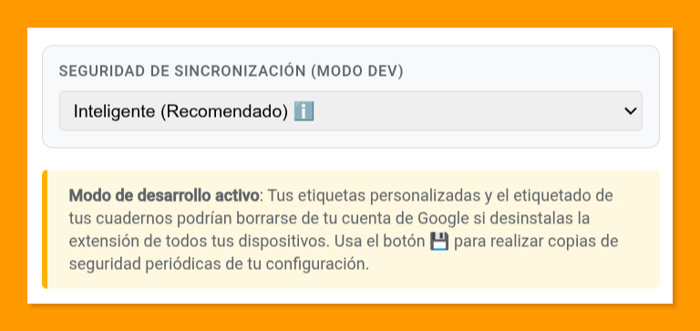
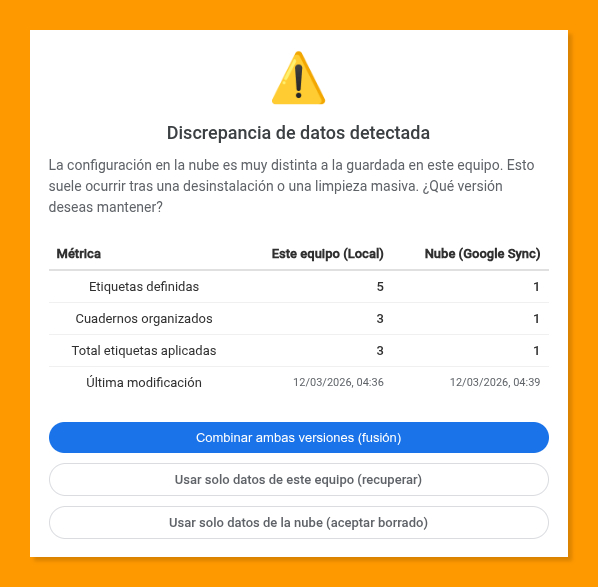

[🇪🇸 Versión en español](README.md) | [🦎 Versió en català](README.ca.md)

# NotebookLM Organizer 🏷️

**NotebookLM Organizer** is a browser extension designed to enhance your workspace organization in [NotebookLM](https://notebooklm.google.com). Featuring an advanced tagging system and dynamic filtering, it allows you to manage your notebooks with a fluid, fully integrated user experience that feels like a native functionality.

---

## 🔒 Privacy & Security

Privacy is at the core of this extension. NotebookLM Organizer is built following the **principle of least privilege**:

- **No Content Access:** The extension **never** reads, accesses, or processes the content of your notes, documents, or sources within your notebooks.
- **Organizational Metadata Only:** It only detects the **notebook name, source count, and creation date**. This data is used strictly to identify the notebook and link it to your tags.
- **No Data Manipulation:** The extension does not modify or manipulate your notebooks in any way. It only adds a visual organization layer on top of the existing Google UI.
- **Your Data is Yours:** All configurations are stored in your Google account (via Chrome Sync), and only you have access to them.

---

## ✨ Key Features

- 🏷️ **Color-Coded Tags:** Create custom tags with a vibrant color palette to categorize your projects visually.
- 🔍 **Advanced Filtering:** Find notebooks instantly by combining text search and tag filters with **AND** or **OR** logic.
- 🌓 **Automatic Dark Mode:** The interface automatically adapts to the theme (light or dark) set in NotebookLM, fully respecting your visual preference.
- 🔄 **Automatic Sync:** Your tags and preferences are automatically synced across all your devices via your Chrome account.
- 💾 **Granular Backup:** Export and import your settings in JSON format, allowing you to choose which elements to restore.
- 🌐 **Multi-language Support:** Interface fully localized in **English, Spanish, and Catalan**, with instant language switching from the UI.
- 💡 **Featured Notebooks Handling:** For cleanliness and convenience, the extension hides the limited preview of featured notebooks in the main "All" tab and automatically disables itself when entering the dedicated "Featured" tab.
- ⚡ **Native Interface:** Designed to provide an extended organization and search experience that feels like a native NotebookLM feature, without disrupting your workflow.

---

## ⚠️ Important Note on List View

Since NotebookLM does not expose internal unique identifiers in all its views, the extension uses a metadata-based "fingerprint" to identify each notebook.

If you have multiple notebooks with the **same name, same number of sources, and same date**, the extension will detect a **collision** in the list view and block tagging for safety to avoid association errors. In these cases, a warning icon (⚠️) will appear, and you should use the **thumbnail view** (grid) to tag them, as that view allows for retrieving a real unique identifier.

---

## ⚙️ Technical Details

*   **No Frameworks or External Dependencies:** Built entirely with **Vanilla JS** and **standard CSS** to ensure maximum lightness, speed, and compatibility.
*   **Manifest V3:** The extension uses the latest version of the Chrome manifest for maximum security and performance.
*   **Chrome Storage Sync & Local:** Uses the Storage API to keep tags synchronized between devices and perform local safety caching.
*   **Dynamic i18n:** Implements a custom localization system that allows for instant language changes without a page refresh.
*   **MutationObserver:** Used to efficiently and reactively detect when new notebooks are added to the list or when navigation occurs.
*   **Data Fragmentation (Chunking):** Sophisticated system to overcome the 8KB limit of Chrome Sync storage by splitting data into chunks.
*   **Predefined extension ID:** The `manifest.json` file includes a public key (`key`) to ensure the extension ID is identical across all manual installations. This is essential for Chrome Sync to recognize them as the same extension and allow synchronization. **Important:** Although the ID is the same for all users of this repository, your data is linked exclusively to your Google account, and no one else can access it.
*   **Permissions:**
    *   `storage`: To save and sync your tags and preferences.

---

## 💾 Data Management and Security

NotebookLM Organizer features an adaptive synchronization engine that automatically detects the installation environment to ensure maximum security for your organization.

Because Google Chrome may delete sync data when uninstalling a manually loaded extension (Dev Mode), a **Dual Redundancy** system and a **Conflict Resolution Assistant** have been implemented.

### 🛠️ Security Modes in Development (Manual Installation)
While the extension is used in development mode, you will have three levels of protection configurable from the tag management modal:

1.  **Intelligent (Recommended):** Uses a **trust heuristic**. If it detects a massive data loss in the cloud (having at least 3 tags locally and detecting less than half in the cloud), the system activates the recovery assistant.
2.  **Manual Validation:** The strictest mode. Whenever there is a discrepancy in metrics between this device and the cloud, the extension will ask you to confirm which version you want to keep.
3.  **Cloud Only:** Disables local redundancy and behaves minimalistically, relying exclusively on Google Sync (identical behavior to the store version).

### 🔄 Recovery Assistant
When an inconsistency is detected, the extension shows a detailed dialog with comparative metrics so you can make an informed decision:

---

## 🧠 Design Philosophy: Independence and Resilience

During the development of this extension, a critical design decision was faced: how to prevent Google from deleting sync data when uninstalling the development version?

A quick fix would have been to register the extension in the Chrome Web Store to obtain an **official ID**. By using this identifier in the development version, cloud data would be "anchored" to the store version, meaning the browser would stop automatically deleting it when uninstalling a local instance. However, the choice was made **not to do so** to prioritize the following principles:

1.  **Sovereignty and Open Source:** By not relying on an ID assigned by a proprietary store, the project remains 100% independent and portable. Anyone can clone the repository and have a functional and secure system without going through the control of an external platform.
2.  **Resilience Architecture:** Instead of trusting a third-party database policy (which can change), a custom security infrastructure has been built. The extension is now an autonomous system capable of self-healing.
3.  **Transparency:** This path forced the creation of the **Conflict Assistant**, which gives the user total control and absolute visibility over their information—something Google's "invisible" system does not provide.

In short: the path of **technical mastery** has been chosen over the short path, ensuring that NotebookLM Organizer is as robust as it is independent.

---

## 🏪 Working in Official Mode (Chrome Web Store)
If the extension is installed from the official store, it detects the environment and simplifies its logic to the maximum. In this mode, it fully trusts the native Google Sync infrastructure and operates lightly without the need to maintain redundant local backups or show conflict dialogs.

### ⚠️ Final Security Recommendations
-   **Always Keep a "Guardian":** As long as you keep the extension installed on at least one device, your data can be automatically recovered thanks to local redundancy.
-   **Manual Export (💾):** Perform periodic backups by downloading your configuration in JSON format. It is your only absolute guarantee of recovery against changes in Google's policies. *Shit happens* 😅.
-   **Updates:** To install a new version of the code in dev mode, do not uninstall the extension. Simply overwrite the files in your folder and click the reload button at `chrome://extensions`.

---

## 🛠️ Installation

The easiest and recommended way to install the extension is through the **Chrome Web Store**:

👉 [**Install from Chrome Web Store**](https://chromewebstore.google.com/detail/bolafachcnffchfenddbfpbfcfhgahen?utm_source=item-share-cb)

### Manual installation (developer mode)
If you prefer to install it manually for testing or to contribute to the code, follow these steps:

1. Download and unzip the zip file or clone this repository on your machine.
2. Open Google Chrome and go to the extensions page: `chrome://extensions`.
3. Enable **"Developer mode"** in the upper right corner.
4. Click the **"Load unpacked"** button.
5. Select the **extension** folder within the downloaded or cloned project folder.
6. Done! The extension will appear in your list of extensions and will be active on `notebooklm.google.com`.

---

## 📝 Note on Maintenance

This extension is officially available on the **Chrome Web Store**. However, as its operation relies on analyzing the DOM structure of the NotebookLM application, which can change at any time without notice, the author warns that maintenance against Google's structural changes will be performed on a voluntary basis. The cost of maintenance and the need to adapt to frequent changes make this a community-driven and open-source project.

> **Important for developers:** If you wish to publish your own version to the Store, the file **`extension/manifest.webstore.json`** has been included. This file is a "clean" version that **does not include the `key` property** (essential for obtaining a new official ID). To use it, simply rename `manifest.webstore.json` to `manifest.json` right before packing the `extension` folder for upload to the developer console.

---

## 🤝 Credits

This project was created and is maintained by **Pablo Felip** ([LinkedIn](https://www.linkedin.com/in/pfelipm/) | [GitHub](https://github.com/pfelipm)).

---

## 📄 License

This project is distributed under the terms of the [LICENSE](LICENSE) file.
